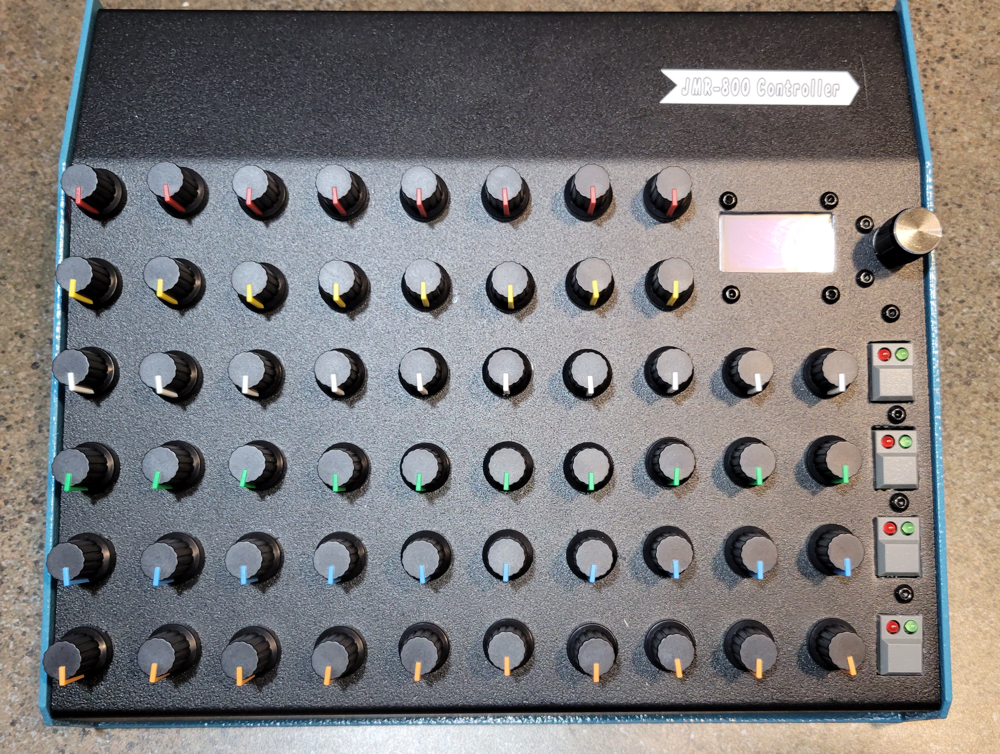

# JMR-800

**JMR-800** is a modern, open-source clone of the Roland PG-800 hardware programmer, built around the Teensy 4.1 microcontroller. It provides real-time 
parameter control for vintage Roland synthesizers such as the JX-8P, MKS-70, and JX-10 using the original PG-800 communication protocol.

The JMR-800 replicates the original PG-800's functionality and physical interface, enabling direct, tactile editing of synthesizer parameters through a 
hands-on control surface.

## Features

- Compatible with Roland synths that support the PG-800 interface
- Built on Teensy 4.1 with fast, low-latency signal handling
- Accurate emulation of the PG-800 protocol (Clock, Ready, and Data lines)
- Designed for easy assembly and expansion
- Open hardware and firmware

## Status

This project is currently in active development. Basic communication and parameter changes are being validated. Contributions, forks, and collaboration are 
welcome.

April 10, 2025

- Redesigned PCB to get rid of the 74HC165 input bit shifter and replaced it with another analog mux/demux.  The total number of parameters that can be 
tweaked with the JX8P with the Vecoven PWM enhancement is 52.  So, I need to support at least 52 pots, and I can only support 48 with three muxes.  I mean
there are enough ADCs on the Teensy 4.1, that I probably could hack it and get those last 4 with separate ADC pins on the Teensy, but that's a pretty 
ineligant design, so I'll just add another mux/demux, get rid of the bit shifter, and limit my use of push buttons to just a few.  I technically only 
need one or two (the PG-800 only has 2), but I'll probably come up with a few odds and ends to implement (like maybe a way to load a whole sound from 
the JMR-800 by tweaking all of the parameters based on loading something from an SD card or something), so having a few more won't hurt.

- Decided to lay out the whole interface with my 3D printer as a template first.  This will allow me to cut cleaner holes into the aluminum case I think.
I'm using an aluminum case from Jameco that looks pretty retro / period correct.

April 14, 2025

Worked on the aluminum case a bit today.  Ran out of potentiometers, so ordered some more.

April 17, 2025

Worked on the case some more.  Completed the potentiometer installation, got some knobs and installed them, though I don't like the fact that I didn't get 
an even number of red and blue, so I need to get another kit of them.  I also don't like the white ones, I think I'll remove those and replace with black.  
Finally, I couldn't find black 3mm screws, so I had to use stainless steel.  I'm going to change that, it ruins the asthetic.

Once I get all that settled, it's back to the software and firmware.  I redesigned the PCB about a week ago, but I think I'm going to need to do a slight 
additional redesign.  The four push buttons have two LEDs on them, a red one and a green one.  I really don't know exactly what I'm going to use them 
for yet, but I'm going to need an output shift register to manage all 8 of them (as well as current limiting resistors for each one, which would probably 
be best on the board rather than dangling and inline with the wires.

The software already works in a prototype way (two potentiometers that I tested with), so hopefully there won't be any surprises when I get all of them 
running.  I also added an additional 3.3V regulator that's optional on the new design, since I'm not altogether sure that the tiny little regulator on the 
Teensy can handle all the load I'm throwing at it.

April 29, 2025

Got the new PCB and the rest of the hardware put together.  I wrote some temporary code that implements a "TEST MODE" that shows the condition of all 
the knobs.

## License

This project is released under the MIT License.

